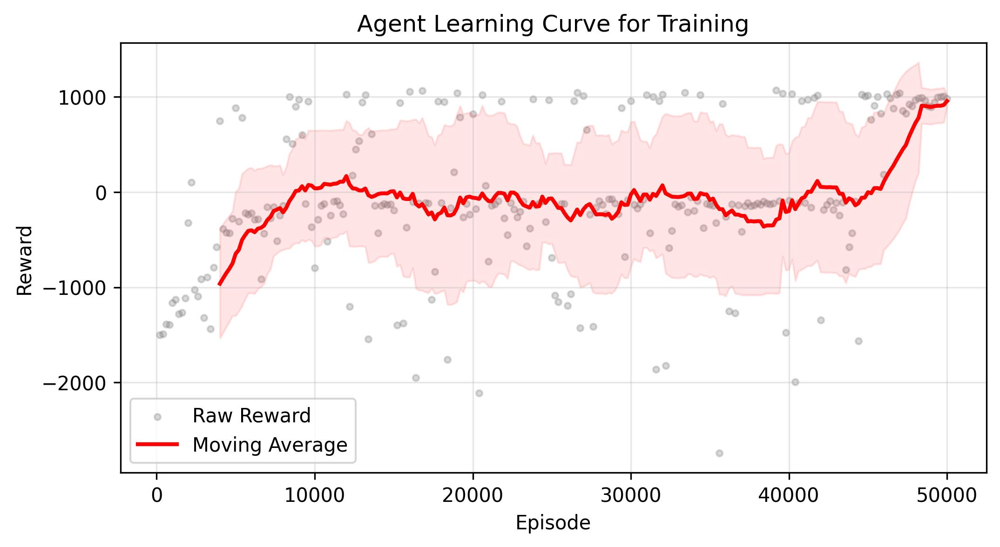
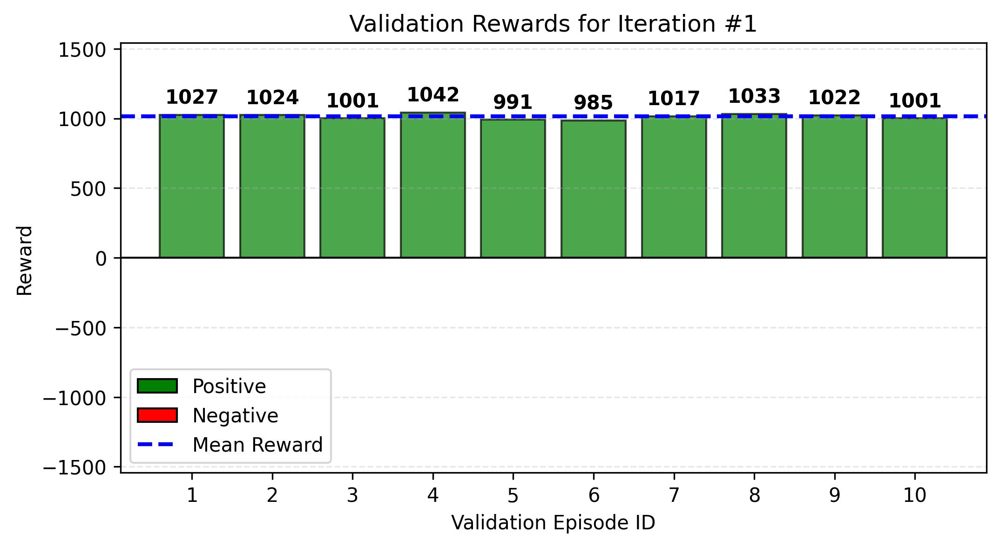
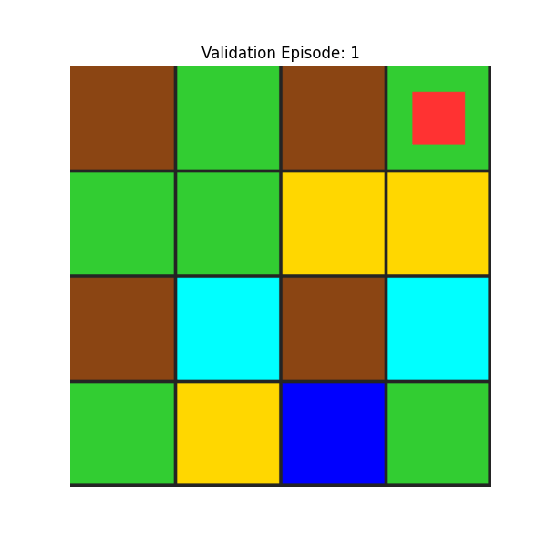

# Akıllı Sulama Report

## Ortam (Environment)

16 tane bitkinin 16 hücre içerisine yerleştirilmesiyle oluşturulan 4x4 bir tarla içinde, sulama robotu, her bir hücredeki bitki için ideal sulama miktarını bulmak zorundadır. Ajanın tarla içerisinde dolaşarak her bir hücre için sulama/sulamama kararı vererek o hücre için ideal nem miktarını koruması beklenir. Aynı zamanda bütün tarlanın hücrelerinden kaç tanesinin ideal nemden uzak olduğunu da bilir.

## Durum (State)

Sistemdeki bir state, sulama robotunun satır ve sütun konumları, robotun bulunduğu hücrenin o anki nem seviyesi, ve sistem genelindeki toplam nem seviyesi kötü olan hücre sayısına göre hesaplanan global panik seviyesinden oluşmaktadır.

Robotun bütün hücrelerdeki anlık nem seviyesini bilmesi, state değerinde üssel bir büyümeye sebep olacağından dolayı, robotun görebileceği tek hücrenin o an içinde bulunduğu hücre olması kısıtı getirilerek sistemdeki muhtemel state sayısı ciddi ölçüde azaltılmıştır. 

Eğer robotun bütün hücrelerdeki nem değerlerini bilmesine izin verilmiş olsaydı her bir hücredeki nem oranları hesabı üssel bir şekilde büyüyeceğinden dolayı hesaplanması gereken state değeri çok büyük bir rakama çıkacaktı. Dolayısıyla robotun görüşü kısıtlanarak sadece içinde bulunduğu hücrenin durumunu bilmesi ve diğer hücrelere karşı tamamen kör davranması sağlanmıştır.

Robotun bütün hücreleri görebildiği bir senaryoda oluşabilecek muthemel state sayısı: 4x4x3^16x3^16 şeklinde olacağından dolayı, ajanın görüşü kısıtlanarak sadece içinde bulunduğu hücerden haberi olacak şekilde state değeri küçültülmüştür.

State Değerleri:

Robot satır konumu, robot sütun konumu, toprak nem dereceleri, global panik seviyesi ⇒ 4x4x3x3

1. Robot Row (0-3)
2. Robot Col (0-3)
3. Current Soil Moisture (Buckets: Dry, Ideal, Wet)
4. Panic Level (0-3)

## State Değişkenleri

**Buckets:**

Tarla ortamı içerisindeki her hücrenin nem değeri float tipinde oluşturulmaktadır. Fakat bu değerler continuous olduğundan dolayı Q tablosu için discrete hale getirip her bir değeri eklemek mümkün olmadığından BUCKET mantığı bu continuous veriyi discrete veriye çevirerek Q tablosuna ekler.

Her bir BUCKET değeri hücrenin nem değerinin hangi yüzde aralığına girdiğini gösteren bir etiketi ifade etmektedir.

**Global Panik Seviyesi:**

Tarla ortamında kaç hücrenin ideal durumdan uzak olduğunu gösteren değerlerdir. Üç farklı değer alabilen panik seviyesi için; PANIC_CALM 0-3 aralığını, PANIC_WORRIED 4-10 aralığını ve PANIC_CRITICAL ise 10'dan fazla hücrenin kötü olduğunu gösterir.

## Robotun Hareketleri (Actions)

- MOVE_SOUTH: Robotun aşağı yönde hareketi
- MOVE_NORTH: Robotun yukarı yönde hareketi
- MOVE_EAST: Robotun sağa hareketi
- MOVE_WEST: Robotun sola hareketi
- WATER_HIGH: Hücrenin nem oranını +35 artırmak
- WATER_LOW: Hücrenin nem oranını +25 artırmak

## Action Mask:

Robot başarılı bir şekilde hücreyi ideal nem oranına getirdikten sonra ideal hücreler içinde gidip gelmesini önlemek ve daha kötü hücreleri keşfetmesini sağlamak için yapabileceği hareketler, action mask ile kısıtlanmış ve robotun döngüye girme riski azaltılmıştır. 

Aynı zamanda dört iterasyon boyunca iki hücre arasında gelip gidiyorsa yeni bir hücreye gitmeye zorlanacak şekilde bir maske de action_mask içinde bulunmaktadır. 

## Bölüm Tamamlanması kısıtları (Done Condition)

Bir bölümün (episode) ne zaman sonlanacağını belirlemek için üç farklı koşul kullanılmıştır. Bunlar; başarı, başarısızlık ve de maksimum adım olarak belirlenmiştir.

**Başarı:**

Bütün hücreler yeşil olursa ajan başarılı bir şekilde görevi gerçekleştirdiğinden bölüm sonlandırılır. (Positive Reward) Bu seviyeye ulaşmak için hücrelerin %100'ünde nem seviyesinin %40-%70 aralığında olması beklenir.

**Başarısızlık:** 

Eğer hücrelerin %80’i kurursa ajan başarısız sayılır ve episode sonlandırılır. Bu seviyeye ulaşmak için hücrelerin %80 ve üzerinin nem oranının 20% değerinin altında veya %90 değerinin üzerinde olması gerekmektedir. 

%20-40 aralığı ile %70-90 aralık değerleri doğrudan bir hücrenin başarılı veya başarısız sayılmaması için bir buffer görevi görmektedir.

**Maksimum adım:** 

Bir bölüm için belirlenen maksimum adım sayısına (step/iteration) ulaşılırsa o bölüm, başarı veya başarısızlık durumundan bağımsız olarak sonlandırılır.

4x4 grid içerisinde toplam 16 hücre (bitki) olduğundan her birine yeterli keşif yapılabilmesi için gerekli olan bölüm başına maksimum adım sayısının da buna uyacak şekilde yüksek tutulması, öğrenme performansını olumlu etkiler.

## Ödül Sistemi (Positive/Negative Rewards)

- Robotu harekete geçmeye teşvik eden başlangıç ödül değeri -0.1’dir.
- Başarılı Bitiş koşulu sağlanırsa robot +1000 ödül alırken, Başarısız Bitiş koşulu sağlanırsa -500 ödül alır.
- Robotun kuru bir hücreye su vermeden veya fazla ıslak bir hücreyi kurutmadan hücreden ayrılması robotun -5 ödül almasına sebep olur.
- Eğer robot, ideal bir hücreye su vermeden veya hücredeki suyu kurutmadan başka bir hücreye geçerse harekete teşvik amaçlı +1 ödül verilir.
- Nem seviyesi yeterli bir hücreyi sulamak veya kurutmaya gerek olmayan bir hücreyi kurutmak robota -5 ödül kazandırır.
- Duvara vurmanın ödülü -1’dir.

## Encode Fonksiyonu

Encode fonksiyonu ajan pozisyonunu, hava durumunu ve de ajanın bulunduğu hürenin nem miktarını tutan indeks değerlerini alarak çok boyutlu bir adresi, tek bir ID değerine çevirir. Bu ID değeri Q tablosuna eklenerek ajanın fiziksel pozisyonuyla birlikte ajanın görebildiği o anki durumun (state) tamamını ifade eder ve ajanın bir sonraki hareketi yapması için karar mekanizmasında kullanılır.

## Kod İşleyişi

### Environment

Environment kodu, sulama sistemi öğrenme ajanının nasıl hareket edeceğini, alacağı negatif ve pozitif ödülleri, q table oluşumu gibi mantığın oluşturulduğu ve gymnasium ile öğrenmenin kurallarının oluşturulduğu kısımdır. Environment fonksiyonları şu şekilde sıralanabilir. 

**init:**

Init fonksiyonu grid içerisinde kaç col kaç row olacağını, her bir hücrenin büyüklüğünü, eğitimin bir bölümünde (episode) maksimum iterasyon sayısını, gözlenebilen state (durum) değeri ile hareket ortamının oluşturulduğu kısımdır. Ajanın konumu, hamle geçmişi, ajanın göremediği global nem bilgileri de yine bu kısımda oluşturulur.

**get_panic_level:**

Toplam grid içerisinde ne kadar kötü ne kadar iyi hücre olduğuna bakarak genel bir panik seviyesi belirler. Ajan bütün hücrelerden haberdar olmadığı için global hücre bilgisine, bu şekilde 3 farklı seviyenin değerini alabilen global panik değeri aracılığyla erişim sağlar.

**encode:**
Bu kısımda ajanın o an içinde grid içerisindeki konumu, global panik seviyesi ve de ajanın bulunduğu hücre içerisindeki nem durumu alınarak tek bir sayısal değere çevrilir. Bu değer q tablosuna ajanın o anki durumunu (state) eklemek için kullanılır. 

Bu değer sadece bir adresi değil, o an ajanın görebildiği bütün koşullar bütününü ifade eder.

**decode:**

Bu kısımda encode fonksiyonu ile tek bir sayısal değere çevrilmiş durum (state) değeri alınarak ters işlemden geçirilir ve de ajan konumu, panik seviyesi ve hücre nem durumu şeklinde bilgiler ayrıştırılır. 

Bu fonksiyon sayısal değeri yeniden farklı bilgilere ayırarak uygulamanın diğer kısımlarında bizim ajanın o anlık konumuna, global panik seviyesine ve de ajanın o an bulunduğu hücrenin nem durumuna rahat bir şekilde ulaşarak bu bilgileri kullanmamızı sağlar.

**get_action_mask:**

Bu kısımda ajanın grid içerisinde yapabileceği davranışlar kısıtlanarak ajanın öğrenmesi hızlandırılır. Ajandan yapmasını istemediğimiz davranışlar veya öğrenmeyi yavaşlatan davranışlar burada tek tek kural olarak tanımlanır ve bu şekilde daha etkili bir öğrenme süreci kurulmuş olur.

Sulama probleminde farklı eğitimler sürecinde ajanın sık sık iki iyi hücre arasında takılıp kalarak daha farklı hücrelere hareket etmediği gözlenlenmiş ve bu maskeleme fonksiyonu içerisine üç kere üst üste aynı hücrede kalınması durumunda son iki adımdan farklı bir hücreye geçişi zorlanacak şekilde bir kural oluşturulmuş ve ajanın sık sık bir döngüye girmesi engellenmiştir.

**step:** 

Öğrenme için en önemli kısım olan **step** fonksiyonu ajanın yaptığı her bir hareket (action) için pozitif ve negatif reward kurallarının oluşturulduğu ve reward hesabının yapıldığı kısımdır.

Buradaki genel mantık, sulamaya ihtiyacı olan hücreler sulanmadığında, kurutulmaya ihtiyacı olmayan hücreler kurutulduğunda negatif reward vermek ve sulanmaya ihtiyacı olmayan bölgeden ayrılmadığında ufak bir negatif reward ile hareketi teşvik etmek üzerine kurulmuştur. 

Başarı ve başarısızlık koşulları toplam hücrelerden ne kadarının ideal nem değerinde (yeşil) olup olmadığı kontrol edilerek belirlenir ve DONE koşulu oluşturulur.

Eğer hücrelerden 80% kadarı ideal (yeşil) durumdan farklı bir nem oranına sahipse episode başarısız olarak kabul edilir ve bölüm sonlandırılır. Başarısızlık durumunda ajana -500 reward verilerek bu davranışın kabul edilemeyeceği ajana öğretilir.

Eğer hücrelerden tamamı ideal koşula getirilmişse (bütün grid hücreleri yeşile döner) başarılı olarak kabul edilerek episode sonlandırılır. Başarılı sonlandırma durumunda ajana +1000 reward verilerek istenilen durum öğretilir.

Eğer maksimum iterasyona ulaşılmış ama başarılı veya başarısız bir sonuca ulaşılamamışsa bir reward olmadan episode sonlandırılır.

Bütün reward hesaplama işlemleri bittikten sonra state tekrar encode ile hesaplanarak o anki durum ortama kaydedilir.

**reset:**

Bu fonksiyon her bir bölüm (episode) başlangıcında çağrılarak ortamı sıfırlar ve ajanın sıfırdan yeni bir bölüme başlayarak o bölüm için tekrardan eğitilmesini sağlar.

Reset fonsiyonu çağrıldıktan sonra ortam ilk oluşturduğumuz zamanki parametrelerde yeniden oluşturularak ajana temiz bir başlangıç sağlar.

**render:**

Bu fonksiyon ortamdan grid bilgilerini ve state bilgilerini alarak bütün bu bilgileri rgb değerleri ile temsil edilecek şekilde numpy array içerisine ekleyerek o anlık ortamın bir örneğini döner.

Bu fonksiyonun çıktısı, ajan eğitildikten veya eğitim doğrulandıktan sonra istenilen episode için bir grid simülasyonu yapmada kullanılır.

### Eğitim

Eğitim kısmı bir eğitim ve bir doğrulama fonksiyonu ile, bu süreçleri görsel olarak takip edebilmmemizi sağlayan ortam simülasyon fonksiyonu ile ödül grafik fonksiyonlarından oluşur.

**train_agent:**
 
Modelin asıl eğitimi bu kısımda gerçekleştirilir. Eğitim için irrigation_environment ile ortam oluşturlmadan hemen önce ajanın eğitimini etkileyecek hiperparemetreler belirlenir.

 - Toplam bölüm sayısı: Bir episode içerisinde toplam kaç bölüm olması gerektiğini gösterir. Ajanın gerçekleştirmesi gereken sulama, kurutma, ve hareket görevlerinin, yapılan testlerde öğrenilmesi zor olduğu fark edilerek bu bölüm sayısı yüksek tutulmuş ve **50_000** olarak belirlenmiştir.
 - max_steps: Toplam iterasyon sayısını belirler ve **600** olarak belirlenmiştir.
 - learning_rate: Q tablosunu güncellemek için kullanılan q fonkisyonunda kullanılır ve ajanın öğrenme hızını belirler. Yüksek tutulursa ajan hızlı öğrenirken düşük tutulduğunda öğrenme hızı yavaşlayabilir. Bu problemde düşük tutulduğunda genel olarak öğrenme performansının arttığı gözlemlenmiş ve **0.15** olarak belirlenmiştir. 
 - discount_rate: Bu değer gelecek ödüllerin şu anki ödüle göre ne kadar önceliklendirilmesini belirleyen değerdir. Söz konusu problemde yüksek tutulduğu durumda daha iyi bir performans gözlemlenmiş ve **0.99** olarak belirlenmiştir.
- epsilon, max_epsilon, min_epsilon, decay_rate: Bu değerler epsilon greedy yaklaşımı sağlayarak exploration-exploitation dengesini sağlamak amacıyla belirlenmiştir. Epsilon başlangıçta 1 olarak belirlenerek her bir fonksiyonda bu değerler kullanılarak azaltılmış ve min_epsilon değerini alana kadar bu azaltma işlemine devam edilmiştir. Epsilon yüksekken daha fazla rastgele hareket yani exploration (keşif) yapılırken epsilon düşükken daha fazla açgözlü hareket yani exploitaiton (sömürme) yapılır. Bu şekilde Öğrenmenin başlarındayken ajan daha fazla keşfe yönlendirilirken sonlara doğru daha fazla sömürü hareketlerini seçmesi sağlanır.

Eğitim fonksiyonunda irrigation_environment ile ortam oluşturularak epsilon hesabı ve ortamdan gelen action_mask ile ajanın hareketi belirlenir ve q tablosu güncellenir. Bu işlem bütün bölümler tamamlanana kadar devam eder. Bu problemde toplam bölüm 50_000 olarak belirlendiğinden dolayı 50_000 iterasyon tamamlandıktan sonra fonksiyon eğitimi sonlandırarak bir q_table, fonksiyon için grids, ve de hangi aralıklarla ödülleri ve animasyon gridlerini kaydettiğini bildiren şog_interval ve animation_interval döner.

**validate_agent:**
Burada eğitim fonksiyonundan elde edilen q tablosu kullanılarak irrigation_environment ile oluşturulan ortama bu q_tablosu girdi olarak verilerek ajanın bu tabloya göre en iyi adımları atarak ne kadar öğrendiği gözlenir. 

Bu fonksiyon, test sırasında elde edilen ödülleri, ortalama ödül değerini ve animasyon için bölüm gridlerini çıktı olarak döndürür.

**animate_traninig_process:**
Test ve eğitim fonksiyonlarından dönen grid bilgileri kullanılarak matplotlib ile bu eğitim için bir test (validation) için bir animasyon olacak şekilde bölümler görselleştirilerek .gif uzantısı ile kaydedilir.

**plot_all_training:**
Eğitim fonksiyonun log_interval değeri ile belirlenen aralıklarla kaydettiği ödül değerleri, kaydedildikleri csv dosyası içinden alınarak ödüller belli bir pencere aralığında hareketli ortalama ile yumuşatılarak line plot olarak görselleştirilir. Aynı zamanda raw ödül değerleri de scatter plot olarak görselleştirilerek ödüllerin eğitim başlangıcından sonuna kadar nasıl bir yakınsmaya sahip olduğu görselleştirilir. Matplot ile yapılan görselleştirme .jpg uzantısı ile kaydedilir.

**plot_validation:** Test (validation) fonksyionundan dönen ödül değerleri bir bar plot ile görselleştirilerek ortalama reward değeri de grafik içinde gösterilir. Matplot ile yapılan görselleştirme .jpg uzantısı ile kaydedilir.

## Sonuçlar
Eğitim fonkisyonundan sonra kaydedilen ödül değerleri kullanılarak yumuşatılmış hareketli ortalama yöntemi ile yapılan görselleştirmeye göre -1500lerde başlayan ödül değerleri +1000lere yakınsayarak ajanın başarılı bir şekilde öğrendiğini göstermektedir. 

Test fonkisyonu sonrasında dönen ödül değerleri ile olışturulan bar grafiği ise öğrenme sonrasında ajanın genellikle +1000 ortalama ödül alarak görevini başarıyla tamamladığını göstermektedir.

### Ortam Simülasyonu

Gerek eğitim sürecindeki bölümlerin gerek test sürecindeki bölümlerin hareketleri, grid içerisinde her bir bileşen farklı renklerle gösterilerek animasyon şeklinde görüntülenebilir. Amaç yeşil hücreleri en yüksek tutarak, kahverengi ve mavi hücrelerden kurtulmaktır. Yeşilden kahverengine veya maviye geçişler ise ara tonlarla gösterilerek hücrelerdeki değişim durumlarını belirtir.

**Örnek Bir Test Simülasyonu**

Test fonksiyonunun çıktısı ile oluşturulan grid simülasyonunda da görüldüğü gibi ajan başarılı bir şekilde hücreleri yeşile çevirerek görevini başarıyla tamamlar ve görevi öğrendiğini göstermiş olur.

